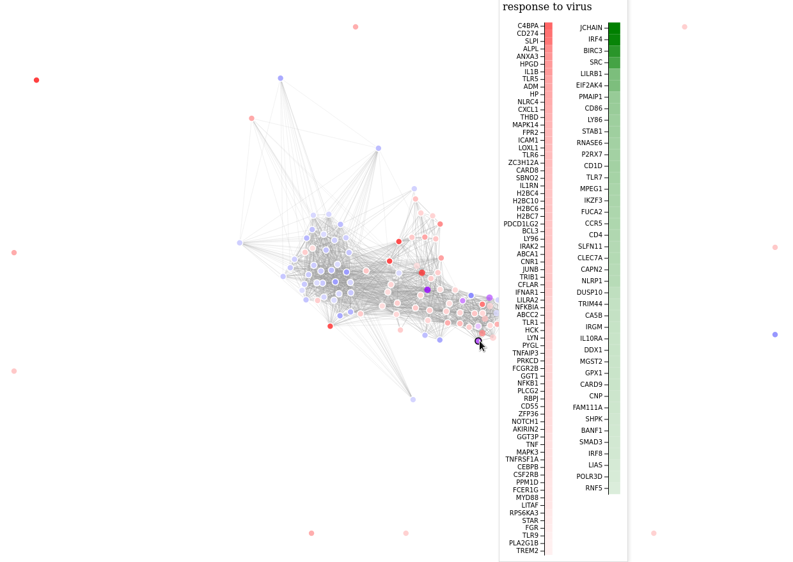

# revigoR


### Quickstart

```R
install.packages('remotes')
remotes::install_github('alexvpickering/revigoR')

library(revigoR)

# setup python virtualenv for scraping revigo (one time only)
setup_env()

# see ?add_path_genes for example workflow starting with limma differential expression
data(go_up1)

# submit goana result to revigo web app and download results to data_dir
data_dir <- tempdir()
scrape_revigo(data_dir, go_up1)

# forcegraph of revigo results (from cytoscape graph)
revigo_forcegraph(data_dir)
```


### Two GO Analyses

Visualize where revigo merges terms across two GO analyses (shades of purple) and doesn't (shades of red and blue for each analysis respectively):

```R
# two analyses
data(go_up2)
go_up1$analysis <- 0
go_up2$analysis <- 1
go_up <- rbind(go_up1, go_up2)

data_dir <- tempdir()
scrape_revigo(data_dir, go_up)
revigo_forcegraph(data_dir)
```

