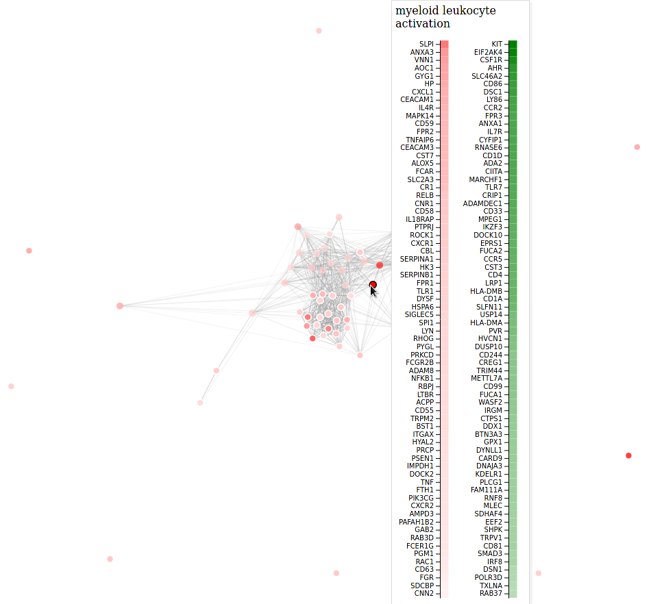

# revigoR


### Quickstart

```R
install.packages('remotes')
remotes::install_github('alexvpickering/revigoR')

library(revigoR)

# setup python virtualenv for scraping revigo (one time only)
setup_env()

# see ?add_path_genes for example workflow starting with limma differential expression
data(go_res)

# submit goana result to revigo web app and download results to data_dir
data_dir <- tempdir()
scrape_revigo(data_dir, go_res)

# various plots of revigo results
revigo_scatterplot(data_dir)
r2d3_forcegraph(data_dir)
```



